# FYP Plan

This document is a guide behind the development of my FYP. It details:

1. the chronological steps made in developing the algorithms and fake datasets
2. how real datasets were obtained and how the data format was decided on for model training
3. how predictions are made and evaluated
4. how our model was compared with other models
5. how a financial application of our model was created with a simple trading strategy and how this fared when compared to benchmarks

## Single-Timeseries Toy Data

Each dataset is generated by a member function of a <code>ToyDatasets</code> class. The single-timeseries toy datasets generated to test the algorithms in this project are listed as follows:

### Stationary

- Stationary without Noise
- Stationary with Gaussian Noise
- Stationary with Non-Gaussian Noise

### Linear Trending

- Linear Trending without Noise
- Linear Trending with Gaussian Noise
- Linear Trending with Non-Gaussian Noise

### Periodical Linear

- Periodical Linear without Noise
- Periodical Linear with Gaussian Noise
- Periodical Linear with Non-Gaussian Noise

### Periodical Sinusoidal

- Periodical Sinusoidal without Noise
- Periodical Sinusoidal with Gaussian Noise
- Periodical Sinusoidal with Non-Gaussian Noise

The class takes as initial parameters a <code>num_elements</code>, that is, the length of the timeseries.

## Evaluation Mechanism:

To evaluate the accuracy of the forecasting, I will train the model on the train set, then evaluate the accuracy of a rolling prediction for the next $n$ days. The metrics for evaluating how accurate the predicted value(s) is/are will be RMSE:

$$
  \text{RMSE} = \sqrt{\frac{1}{n}\sum_{i=1}^n(Y_i - \hat{Y_i})^2}
$$

The train-test split will be 75:25.

## Algorithm Design - Stage 1: DMD as a Minimisation Problem

### DMD Approximation Formula

The stage 1 algorithm is a minimisation model representation of Dynamic Mode Decomposition. DMD seeks to approximate a linear approximator from one element of a timeseries to the next, that is:

$$
  x_{k+1} = \boldsymbol{A}x_k
$$

### DMD Vector/Matrix Form

In vector/matrix form, given an input data sequence $\boldsymbol{x} = \{x_1, x_2, \ldots, x_n\}$, where for now each element $x_i$ is a scalar, we construct two subset vectors of $\boldsymbol{x}$: $\boldsymbol{x}_1^{n-1}$ and $\boldsymbol{x}_2^{n}$, with the subscript indicating the index the subset starts at and the superscript indicating the index the subset ends at. Therefore, this model can be written as:

$$
  \boldsymbol{x}_2^{n} = \boldsymbol{A}\boldsymbol{x}_1^{n-1}
$$

### Algorithm

The first form of the algorithm will be to form a model that approximates A by approximating the above equation; that is, minimising the residual between the predicted and true next datapoint:

$$
  \min_{A} \quad \lVert\boldsymbol{x}_2^n - \boldsymbol{A}\boldsymbol{x}_1^{n-1}\lVert^2
$$

## Stage 1 Algorithm with Toy Data

The system accurately learns the stationary behaviour without noise, with an error of essentially 0.

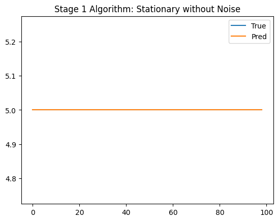

Likewise, the system learns the linear trending behaviour without noise, with an error of 0.023:

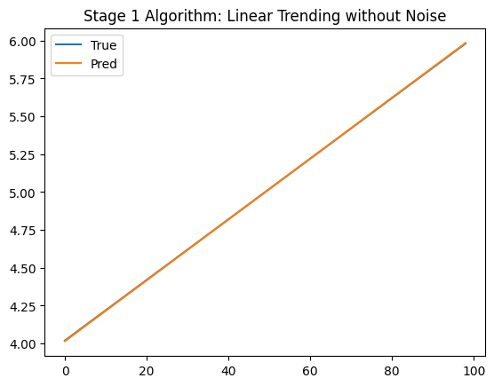

However, the system begins to suffer with noisy data. For stationary data with Gaussian noise, the model tries to predict similar values to the previous datapoint, which is understandably much more inaccurate with noisy data that fluctuates rapidly away from the previous datapoint; the error is 1.36:

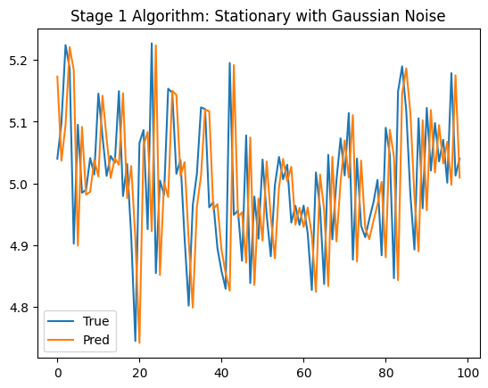

For the linear trending data with gaussian noise, the model visually seems to follow the linearly increasing behaviour, but this is just because each predicted point is a function of the previous point, so the predicted trend would just keep increasing based on previous predictions. As such, the RMSE is similar to the stationary data, being 1.36:

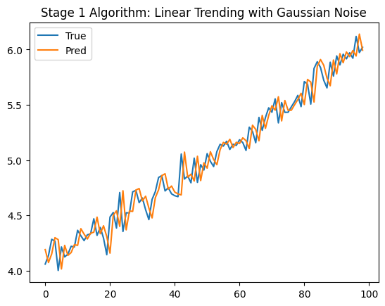

For more accurate behaviour, it would be wise to take into account more past values to understand the trends better, and handle noise properly, starting with Gaussian noise.

## Algorithm Design - Stage 2: Autoregression over Multiple Terms

### AR

Already, we have seen that our algorithm is an autoregressive model: the prediction for the next point in the sequence is just a linear operator of the previous point, and thus an autoregressive process with order 1. An obvious next step is to consider not only the previous single datapoint, but the past $d$ datapoints; that is:

$$
  x_{k+d} = A_1x_k + A_2x_{k+1} + \ldots + A_dx_{k+d-1}
$$

### Hankel DMD

To do this, one simply needs to solve the Hankel DMD equation:

$$
  \boldsymbol{X}_{H,2}^n = \boldsymbol{A}_H \boldsymbol{X}_{H,1}^{n-1}
$$

where:

$$
  \boldsymbol{A}_H = \begin{bmatrix}
    0 & 1 & & & \\
    & 0 & 1 & & \\
    & & \ddots & \ddots & \\
    & & & 0 & 1 \\
    A_1 & A_2 & A_3 & \ldots & A_d \\
  \end{bmatrix}
$$

and:

$$
  \boldsymbol{X}_{H,1}^{n-1} = \begin{bmatrix}
    x_1 & x_2 & \ldots & x_{n-d} \\
    x_2 & x_3 & \ldots & x_{n-d+1} \\
    \vdots & \vdots & \ddots & \vdots \\
    x_d & x_{d+1} & \ldots & x_{n-1} \\
  \end{bmatrix}

  \quad , \quad

  \boldsymbol{X}_{H,2}^n = \begin{bmatrix}
    x_2 & x_3 & \ldots & x_{n-d+1} \\
    x_3 & x_4 & \ldots & x_{n-d+2} \\
    \vdots & \vdots & \ddots & \vdots \\
    x_{d+1} & x_{d+2} & \ldots & x_{n} \\
  \end{bmatrix}
$$

and so the input vectors $\boldsymbol{x}_1^{n-1}$ and $\boldsymbol{x}_2^{n}$ are replaced by the Hankel matrices $\boldsymbol{X}_{H,1}^{n-1}$ and $\boldsymbol{X}_{H,2}^{n}$ respectively.

### Algorithm

As with the stage 1 algorithm, the parameters $A_1, A_2, \ldots, A_d$ will be learned by solving for the minimum of the residual between the predicted and true next outputs:

$$
  \min_{A_1, A_2, \ldots, A_d} \quad \lVert\boldsymbol{X}_{H,2}^n - \boldsymbol{A}_H \boldsymbol{X}_{H,1}^{n-1}\lVert^2
$$

## Stage 2 Algorithm with Toy Data

The stage 2 algorithm performs better with noisy data. For example, for the stationary timeseries with gaussian noise, the error is 0.11 as opposed to 1.36:

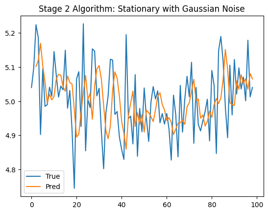

while the performance on the linear trending with gaussian noise dataset was also of error 0.11, as opposed to 1.36 for the stage 1 algorithm:

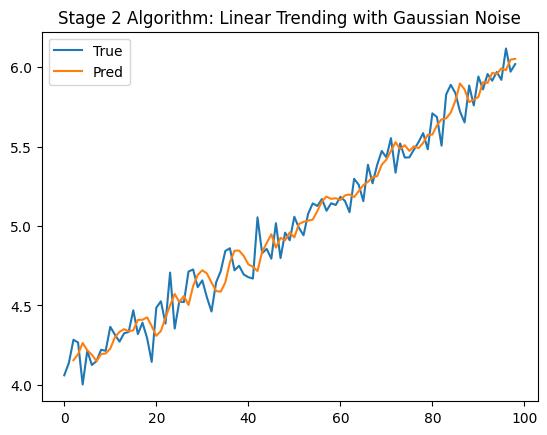

The algorithm also performs decently on periodical datasets. For example, for the periodical linear without noise, the stage 2 algorithm obtains an error of 0.12:

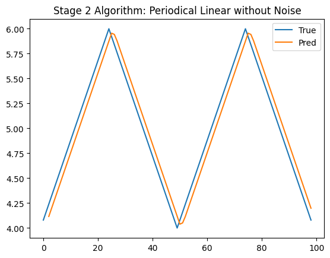

For a sinuosoid, the system performs similarly to the periodical linear, with an error of essentially 0.11:

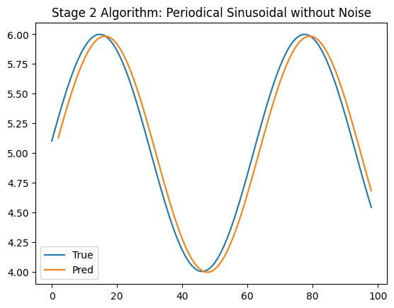

For both periodical datasets, there is an expected reduction in performance with noise in the system. For example, for the periodical linear with gaussian noise timeseries, the model obtains an error of 0.17:

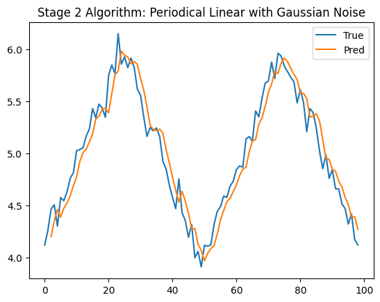

and for the periodical sinusoidal with gaussian noise timeseries, the model obtains an error of 0.16:

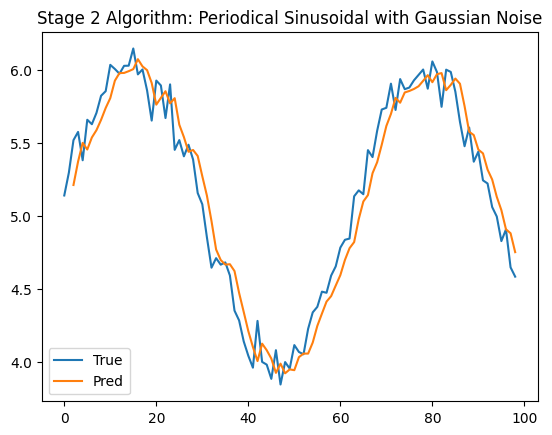

Moving forwards, it will be interesting to see how the effect of first gaussian noise and later non-gaussian noise can be removed.

## Algorithm Design - Stage 3: Handling Gaussian Noise

**_TODO: WRITE THIS_**

## Stage 3 Algorithm with Toy Data

**_TODO: WRITE THIS_**

## Algorithm Design - Stage 4: Handling Non-Gaussian Noise

**_TODO: WRITE THIS_**

## Stage 4 Algorithm with Toy Data

**_TODO: WRITE THIS_**

## Multi-Timeseries Toy Data

The <code>ToyDatasets</code> class also uses a <code>num_features</code> class variable to handle multiple timeseries at once. Several member functions are defined inside the class to produce datasets containing multiple timeseries with specified correlations, as such:

### Multiple Linear Trending

- Multiple Linear Trending without Noise
- Multiple Linear Trending with Gaussian Noise
- Multiple Linear Trending with Non-Gaussian Noise

### Multiple Periodical Sinusoidal

- Multiple Periodical Sinusoidal without Noise
- Multiple Periodical Sinusoidal with Gaussian Noise
- Multiple Periodical Sinusoidal with Non-Gaussian Noise

## Algorithm Design - Stage 5: Multiple Timeseries Analysis

**_TODO: WRITE THIS_**

## Stage 5 Algorithm with Toy Data

**_TODO: WRITE THIS_**

## Obtaining Financial Data

Financial data can be obtained from the Yahoo Finance API. For example, Apple stock data can be obtained by requesting the "AAPL" stock ticker.

## Price, Returns or Volatility?

The data returned from the Yahoo Finance API contains an 'Adj Close' column, or 'Adjusted Close'. This represents the 'Close' price (the last price at which the asset was traded at during the trading day) adjusted to take into account certain factors, such as dividends and stock splits. This can be treated as the 'Price' we will use. However, prices are completely unpredictable and follow brownian motion. As such, price of an asset is difficult to predict based on price of the asset alone.

An alternative to the Adjusted Close price is the returns of an asset; that is, the day-to-day gains/losses in price. There are simple and log returns, with both having their advantages - simple returns are easier to interpret, whereas one can manipulate log returns more easily - but log returns tend to be used more.

Finally, there is also volatility, or the rolling standard deviation of the stock. One can consider the rolling standard deviation of the returns or the raw price; in our case we will consider the returns for no significant reason.

The reason for choosing different formulations of the data - price, returns and volatility - to train our model on is because our model is autoregressive, and so ideally we would use data that exhibits the strongest autocorrelation. ACF plots were made for each of the four data forms (adjusted close, simple returns of adjusted close, log returns of adjusted close and volatility of the log returns). To understand the ACF plot, the points describe the autocorrelation of the timeseries with the point lagged by the value on the x axis with respect to the point. The shaded blue area indicates the 95% confidence interval; that is, points existing outside the shaded area are likely to mean that there is strong autocorrelation there. The plots are as follows:

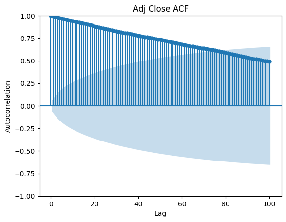

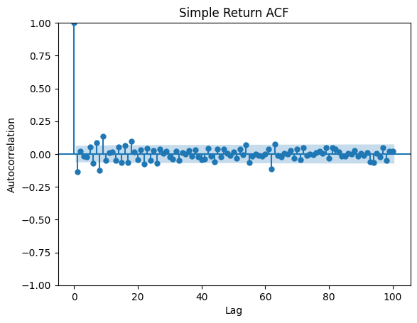

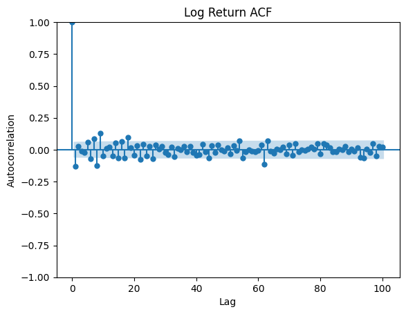

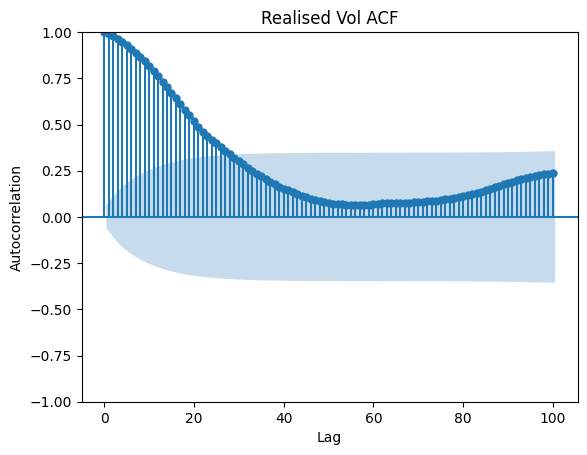

As we can see, volatility (as expected) is strongly autocorrelated to recent values. It appears that the adjusted close experiences strong ACF over many recent points, with the ACF linearly decreasing with lag. This is suspicious, for reasons listed before, so will be experimented. Finally, the returns are not strongly correlated at all to previous values, which means that it will be difficult to forecast future returns using our model. This will hopefully be proven in experiments.

## Stocks or Options?

One does not only have access to stocks on the Yahoo Finance API. There are also options, which are assets that you agree to the option of buying/selling at a predetermined price at a predetermined date in the future. Now, why would this be useful? Well, it was clear that volatility was strongly autocorrelated to recent values, which is good for our autoregressive model. However, even if one accurately predicts volatility, one cannot turn that into a prediction for prices. However, options can do this using the black-scholes model. The next section goes into the detail of this model.

## Black-Scholes Model

**_TODO: WRITE THIS_**

## Alternative Models for Comparison.

**_TODO: WRITE THIS_**

### PCA

**_TODO: WRITE THIS_**

### ARIMA

**_TODO: WRITE THIS_**

### Neural Networks

**_TODO: WRITE THIS_**

## Experiments on Real Financial Data

**_TODO: WRITE THIS_**

## Trading Strategy

**_TODO: WRITE THIS_**

## Comparison with Benchmarks

**_TODO: WRITE THIS_**
